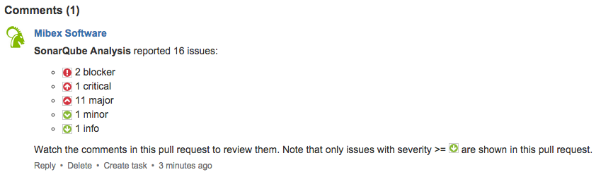
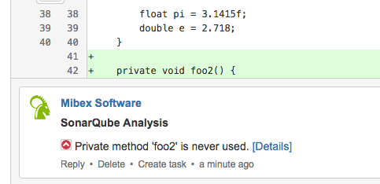
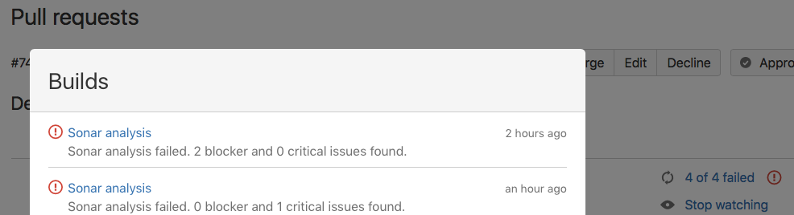
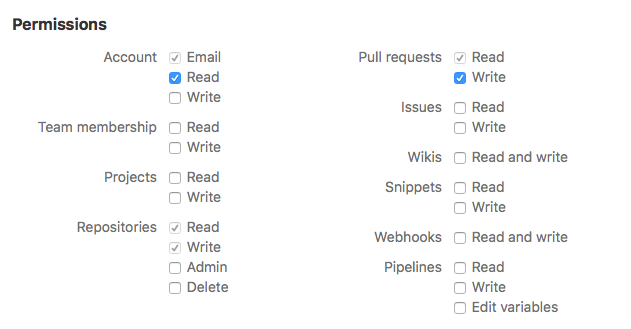

# Bitbucket Cloud plug-in for SonarQube

[](https://travis-ci.org/mibexsoftware/sonar-bitbucket-plugin)

## PLEASE NOTE: The plug-in only supports SonarQube versions < 7.7 due do the required preview mode

### Download it from [Github releases page](https://github.com/mibexsoftware/sonar-bitbucket-plugin/releases/latest)

This SonarQube plug-in creates pull request comments for issues found in your Bitbucket Cloud pull requests. It is very
similar and inspired by the [SonarQube Github plug-in](https://github.com/SonarCommunity/sonar-github), but targets 
Bitbucket Cloud. It creates a summary of the found issues as a global pull request comment which looks like this:



For every found issue on changed or new lines of the pull request, it will also create a pull request comment with
the severity, the explanation what this issue is about and a link to get more details about it:



And it can also approve/unapprove the pull request and update the build status according to the SonarQube analysis
results (if there are any blocker or critical issues found, the build is considered failed and the pull request
unapproved):



## Usage

### Prerequisites
- SonarQube >= 6.7.x and SonarQube < 7.7.x
- A Bitbucket Cloud account
- Maven 3.x + JDK (to manually build it)

### Important facts
- This plug-in only supports Git (no Mercurial) repositories.
- It can only be run in SonarQube's "preview/issues" mode. You cannot use it with "publish" (persistent) mode! 

### Installation

The plug-in will probably once be available in the SonarQube update center. Until then, you can download it from our 
[Github releases page](https://github.com/mibexsoftware/sonar-bitbucket-plugin/releases/latest).

If you want, you can also build the plug-in manually like follows:

```
mvn clean install
```

After you copied the plugin's JAR to `{SONARQUBE_INSTALL_DIRECTORY}/extensions/plugins`, you need to restart your
SonarQube instance.

### Troubleshooting

If you experience any issues with the plug-in, check the build log for any suspicious messages first. The plug-in writes 
messages to the log with the prefix ```[sonar4bitbucket]```. Possible issues are often related to authentication. Please 
make sure that you have configured a callback URL in Bitbucket when using OAuth. If authentication worked but you don't 
see any pull request comments being made for code issues, run the build in debug mode, create a 
[bug report](https://github.com/mibexsoftware/sonar-bitbucket-plugin/issues) and attach important debug log lines to it. 
To generate a log with debug level, use the following parameters to trigger SonarQube:

```
mvn sonar:sonar -X -Dsonar.verbose=true ...
```

### Configuration for Jenkins with Maven

You need to run this plug-in as part of your build. Add a build step of type `Execute shell` to your Jenkins job with
the following content:
 
```
mvn clean verify sonar:sonar --batch-mode --errors \
     -Dsonar.bitbucket.repoSlug=YOUR_BITBUCKET_REPO_SLUG \
     -Dsonar.bitbucket.accountName=YOUR_BITBUCKET_ACCOUNT_NAME \
     -Dsonar.bitbucket.teamName=YOUR_BITBUCKET_TEAM_NAME \
     -Dsonar.bitbucket.apiKey=YOUR_BITBUCKET_API_KEY \
     -Dsonar.bitbucket.branchName=$GIT_BRANCH \
     -Dsonar.host.url=http://YOUR_SONAR_SERVER \
     -Dsonar.login=YOUR_SONAR_LOGIN \
     -Dsonar.password=YOUR_SONAR_PASSWORD \
     -Dsonar.analysis.mode=issues
```
 
See this table about the possible configuration options:


| Parameter name                               | Description                                                                                                                                                                                                                    | Default value                                  | Example                |
|----------------------------------------------|--------------------------------------------------------------------------------------------------------------------------------------------------------------------------------------------------------------------------------|------------------------------------------------|------------------------|
| sonar.bitbucket.repoSlug                     | The slug of your Bitbucket repository (https://bitbucket.org/[account_name]/[repo_slug]).                                                                                                                                      |                                                | sonar-bitbucket-plugin |
| sonar.bitbucket.accountName                  | The Bitbucket account your repository belongs to (https://bitbucket.org/[account_name]/[repo_slug]).                                                                                                                           |                                                | mibexsoftware          |
| sonar.bitbucket.teamName                     | If you want to create pull request comments for Sonar issues with an app password, provide your Bitbucket user name here.                      |                                                | a_team                 |
| sonar.bitbucket.apiKey                       | If you want to create pull request comments for Sonar issues with an app password, provide your app password here.                                                      |                                                |                        |
| sonar.bitbucket.oauthClientKey               | If you want to create pull request comments for Sonar issues under your personal account, provide the client key of the new OAuth consumer here (needs repository and pull request WRITE permissions).                         |                                                |                        |
| sonar.bitbucket.oauthClientSecret            | If you want to create pull request comments for Sonar issues under your personal account, provide the OAuth client secret for the new OAuth consumer here.                                                                     |                                                |                        |
| sonar.bitbucket.branchName                   | The branch name you want to get analyzed with SonarQube. When building with Jenkins, use $GIT_BRANCH. For Bamboo, you can use ${bamboo.repository.git.branch}.                                                                 |                                                | $GIT_BRANCH            |
| sonar.bitbucket.pullRequestId                | The ID of the pull request to analyze with SonarQube.                                                                                                                                                                          |                                                | 1                      |
| sonar.bitbucket.branchIllegalCharReplacement | If you are using SonarQube version <= 4.5, then you have to escape '/' in your branch names with another character. Please provide this replacement character here.                                                            |                                                | _                      |
| sonar.bitbucket.minSeverity                  | Either INFO, MINOR, MAJOR, CRITICAL or BLOCKER to only have pull request comments created for issues with severities greater or equal to the chosen severity.                                                                  | MAJOR                                          | CRITICAL               |
| sonar.bitbucket.approvalFeatureEnabled       | If enabled, the plug-in will approve the pull request if there are no issues with severity >= sonar.bitbucket.maxSeverityApprovalLevel, otherwise it will unapprove the pull request.                                          | true                                           | false                  |
| sonar.bitbucket.buildStatusEnabled           | If enabled, the plug-in will update the build status of the pull request depending on the Sonar analysis result. The analysis and also the build is failed if there are any critical or blocker issues.                        | true                                           | false                  |
| sonar.bitbucket.maxSeverityApprovalLevel     | If any issues of this level or higher are found, it will unapprove the pull request.                                                                                                                                           | CRITICAL                                       | MAJOR                  |


For authentication, you have to decide between if you want to create pull request comments under by using OAuth 
or with an app password.

If you go with OAuth, you have to configure a callback URL and use the Bitbucket permissions "Repository write" and 
"Pull requests write" (for commenting on the pull request) as well as "Account read" for the new OAuth consumer. The permissions should look like follows:


 
If everything is configured as explained, you should see pull request comments for all found Sonar issues in your pull
request after the next push to your Bitbucket repository.


### Configuration for Bamboo with Maven

You need to run this SonarQube plug-in as part of your build. To achieve this, add a build task of type `Maven 3.x` to
your Bamboo job with the following task goal:
 
```
clean verify sonar:sonar --batch-mode --errors \
     -Dsonar.bitbucket.repoSlug=YOUR_BITBUCKET_REPO_SLUG \
     -Dsonar.bitbucket.accountName=YOUR_BITBUCKET_ACCOUNT_NAME \
     -Dsonar.bitbucket.teamName=YOUR_BITBUCKET_TEAM_ID \
     -Dsonar.bitbucket.apiKey=YOUR_BITBUCKET_API_KEY \
     -Dsonar.bitbucket.branchName=${bamboo.repository.git.branch} \
     -Dsonar.host.url=http://YOUR_SONAR_SERVER \
     -Dsonar.login=YOUR_SONAR_LOGIN \
     -Dsonar.password=YOUR_SONAR_PASSWORD \
     -Dsonar.analysis.mode=issues
```

### Configuration with Bitbucket Pipelines

To configure for use with [Bitbucket Pipelines](https://bitbucket.org/product/features/pipelines) You will need to add the following [environment variables](https://confluence.atlassian.com/bitbucket/environment-variables-794502608.html):
 - OAUTH_CLIENT_KEY
 - OAUTH_CLIENT_SECRET
 - SONAR_HOST_URL
 - SONAR_LOGIN
 - SONAR_PASSWORD 
 
The minimal configuration for Pipelines is as follows:

```
# The Sonar Bitbucket plug-in will run on the default Pipeline.
# -----
image: maven:3.5.0

pipelines:
  default:
    - step:
        script:
          - mvn clean test
          - mvn sonar:sonar --batch-mode --errors -Dsonar.bitbucket.repoSlug=$BITBUCKET_REPO_SLUG -Dsonar.bitbucket.accountName=$BITBUCKET_REPO_OWNER -Dsonar.bitbucket.oauthClientKey=$OAUTH_CLIENT_KEY -Dsonar.bitbucket.oauthClientSecret=$OAUTH_CLIENT_SECRET -Dsonar.bitbucket.branchName=$BITBUCKET_BRANCH -Dsonar.host.url=$SONAR_HOST_URL -Dsonar.login=$SONAR_LOGIN -Dsonar.password=$SONAR_PASSWORD -Dsonar.analysis.mode=issues
```

Note: The Pipeline must run at least once after the pull request is created.


### Configuration with SonarRunner

The configuration of the SonarRunner parameters is actually the same as with Maven. Just run SonarRunner like follows:

```
sonar-runner -Dsonar.analysis.mode=issues <other-options>
```


### Using a proxy

If you use a proxy, you can configure the host and port like follows:

```
-Dhttp.proxyHost=http://localhost -Dhttp.proxyPort=9000
```
